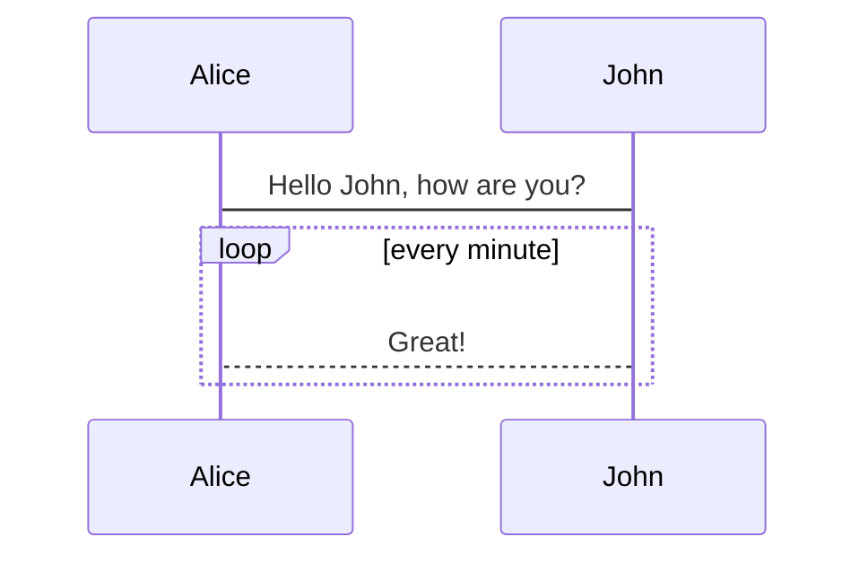

<!--
 * @Author: 储天航 1193983801@qq.com
 * @Date: 2023-03-06 16:08:31
 * @LastEditors: 储天航 1193983801@qq.com
 * @LastEditTime: 2023-03-06 17:42:05
 * @FilePath: \trent-blog\docs\work\learn\redux.md
 * @Description: 这是默认设置,请设置`customMade`, 打开koroFileHeader查看配置 进行设置: https://github.com/OBKoro1/koro1FileHeader/wiki/%E9%85%8D%E7%BD%AE
-->

## Redux

概念：Redux 是 JavaScript 应用的状态容器，提供可预测的状态管理。

<!-- createSlice -->

### 术语

- actions : An action is a plain JavaScript object that has a type field. You can think of an action as an event that describes something that happened in the application.(一个 action 是一个带有普通 type 类型的普通 js 对象，你可以理解为一个 anction 作为描述发生在应用中的一个事件）

  - 写法 类似 "domain/eventName" domain，可以理解为 action 的特征或者类目,eventName:具体的特征是什么

  ```js
  const addTodoAction = {
    type: "todos/todoAdded",
    payload: "Buy milk",
  };
  ```

- Action Creators :An action creator is a function that creates and returns an action object.
  创建一个函数并返回一个 action

  ```js
  const addTodo = (text) => {
    return {
      type: "todos/todoAdded",
      payload: text,
    };
  };
  ```

- Reducers:A reducer is a function that receives the current state and an action object,decides how to update the state if necessary, and returns the new state: (state, action) => newState. (接受两个参数，当前的 state,和一个 action,决定什么时候更新，返回一个新的状态)
- Store:The current Redux application state lives in an object called the store .(当前的 Redux 应用程序状态存在于一个名为 store 的对象中)
- Dispatch:The Redux store has a method called dispatch. 更新状态的唯一方法是调用 store.dispatch(),参数为一个 action 对象。 以将调度操作（Dispatch action）视为应用程序中的“触发事件”

  ```js
  const increment = () => {
    //Action Creators
    return {
      type: "counter/increment",
    };
  };
  store.dispatch(increment()); // store 触发了 减少数量的动作
  console.log(store.getState());
  // {value: 2}
  ```

- Selectors : Selectors are functions that know how to extract specific pieces of information from a store state value.(如何从存储状态值中提取特定信息的函数。)


